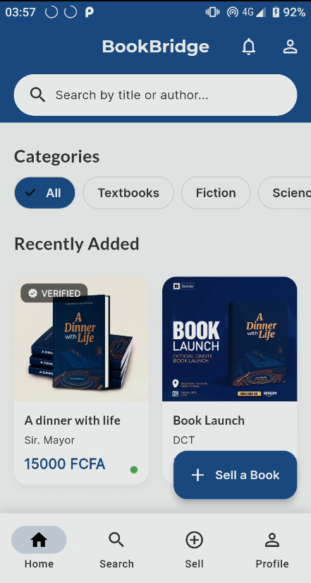
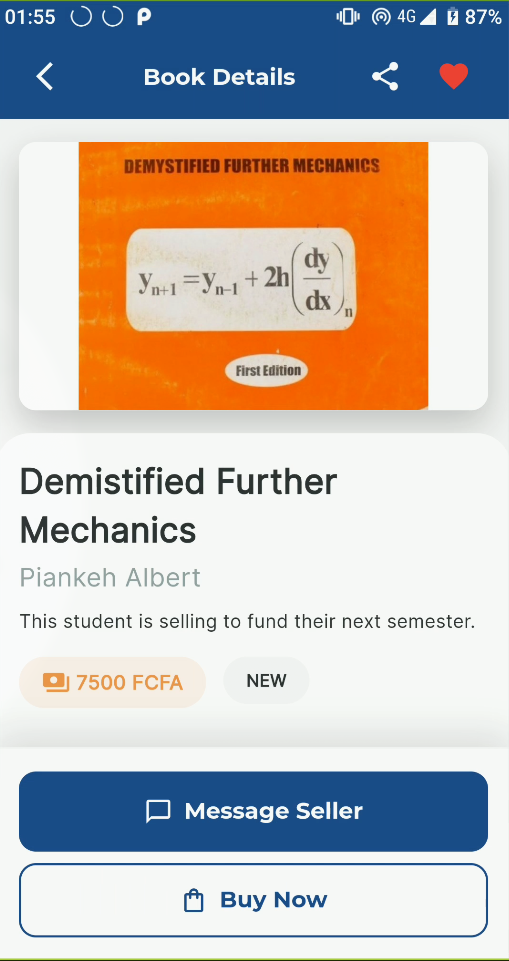
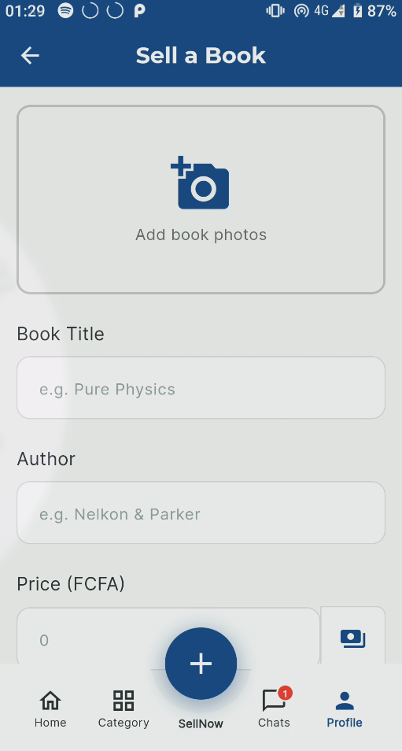

# BookBridge 📚

[](https://flutter.dev/)
[](https://supabase.io/)
[](https://opensource.org/licenses/MIT)
[](https://flutter.dev/)

A peer-to-peer marketplace for Cameroonian students to buy and sell used physical books. Built with Flutter and powered by Supabase, BookBridge connects students locally to simplify the process of finding affordable books and monetizing used collections.

## 🌟 Features

### Core Functionality
- **User Authentication**: Secure email/password signup and signin via Supabase
- **Browse Listings**: Discover available books in a responsive grid layout with infinite scroll pagination
- **Smart Search**: Full-text search across book titles and authors
- **Detailed Listings**: View comprehensive information about each book including images, pricing, and seller contact info
- **Sell Books**: Create listings with custom pricing, condition selection, and images
- **Profile Management**: Manage your profile and track your listings and sales
- **Direct Communication**: Contact sellers directly via WhatsApp for seamless transactions

### Technical Highlights
- **Clean Architecture**: 3-layer architecture (Domain, Data, Presentation) with clear separation of concerns
- **State Management**: Provider pattern with ChangeNotifier for efficient state handling
- **Dependency Injection**: get_it for service locator pattern
- **Navigation**: go_router for intuitive routing and deep linking
- **Error Handling**: Either<Failure, Success> pattern using dartz for robust error management
- **UI/UX**: Material Design 3 with elegant dark theme optimized for readability
- **Responsive Design**: Works seamlessly across all screen sizes and orientations

## 🏗️ Architecture

The application follows Clean Architecture principles with clear separation of concerns:

```
lib/
├── core/                      # Core functionality shared across features
│   ├── error/                # Error handling (Failures, Exceptions)
│   ├── theme/                # Application theming
│   └── usecases/             # Base UseCase classes
├── features/                 # Feature modules
│   ├── auth/                 # Authentication feature
│   │   ├── domain/          # Business logic (entities, repositories, use cases)
│   │   ├── data/            # Data sources and repositories (Supabase)
│   │   └── presentation/    # UI and state management (screens, view models)
│   └── listings/            # Listings feature
│       ├── domain/
│       ├── data/
│       └── presentation/
├── config/                   # App-wide configuration (routing, DI)
├── injection_container.dart  # Dependency injection setup
└── main.dart                # App entry point
```

## 🚀 Getting Started

### Prerequisites
- Flutter SDK (3.0+)
- Dart SDK (included with Flutter)
- A Supabase project account

### Installation

1. Clone the repository:
```bash
git clone https://github.com/yourusername/book-bridge.git
cd book-bridge
```

2. Get dependencies:
```bash
flutter pub get
```

3. Configure environment variables:
   - Create a `.env` file in the project root with your Supabase credentials:
     ```
     SUPABASE_URL=your_supabase_project_url
     SUPABASE_ANON_KEY=your_supabase_anon_key
     ```
   - Note: The `.env` file is in `.gitignore` and will not be committed to version control
   - Ensure the following tables exist in your Supabase database:
     - `profiles`: User profile information
     - `listings`: Book listings with seller and book details

4. Run the app with environment variables:
```bash
flutter run --dart-define=SUPABASE_URL=$(cat .env | grep SUPABASE_URL | cut -d'=' -f2) --dart-define=SUPABASE_ANON_KEY=$(cat .env | grep SUPABASE_ANON_KEY | cut -d'=' -f2)
```

Alternatively, you can define the environment variables directly when running the app:
```bash
SUPABASE_URL=your_url SUPABASE_ANON_KEY=your_key flutter run
```

### Database Schema

#### profiles table
```sql
- id (UUID, primary key)
- email (text)
- full_name (text)
- locality (text, nullable)
- whatsapp_number (text, nullable)
- created_at (timestamp)
```

#### listings table
```sql
- id (UUID, primary key)
- title (text)
- author (text)
- price_fcfa (integer)
- condition (text: 'new', 'like_new', 'good', 'fair', 'poor')
- image_url (text)
- description (text, nullable)
- seller_id (UUID, foreign key to profiles)
- status (text: 'available', 'sold', 'pending')
- created_at (timestamp)
```

## 🧭 Navigation

The app uses go_router for navigation with auth state-based redirection:

- `/`: Splash screen (redirects based on auth state)
- `/sign-in`: Sign in screen
- `/sign-up`: Sign up screen
- `/home`: Home feed with listings grid
- `/listing/:id`: Listing details screen
- `/search`: Search listings
- `/sell`: Create new listing
- `/profile`: User profile and listings management

## 💡 State Management

The app uses Provider with ChangeNotifier pattern for state management:

- **AuthViewModel**: Manages authentication state and user session
- **HomeViewModel**: Manages home feed listings with pagination
- **ListingDetailsViewModel**: Manages single listing details display
- **SellViewModel**: Manages listing creation form and validation
- **ProfileViewModel**: Manages user profile and listings management
- **SearchViewModel**: Manages search functionality and results

## ⚠️ Error Handling

Errors are handled using a functional approach with the Either pattern from dartz:

```dart
// Example: Either<Failure, Success>
final result = await someUseCase(params);
result.fold(
  (failure) => handleError(failure.message),
  (success) => handleSuccess(success),
);
```

Error types:
- `AuthFailure`: Authentication-related errors
- `ServerFailure`: Server and network errors
- `UnknownFailure`: Unexpected errors
- `NotFoundException`: Resource not found

## 🛠️ Development

### Code Quality
The project maintains high code quality standards:

- **dart fix --apply**: Automated code fixes
- **flutter analyze**: Linting and analysis (0 issues)
- **dart format**: Consistent code formatting

### Implemented Phases

#### Phase 1: Project Initialization ✅
- Flutter project setup with all required dependencies
- Boilerplate cleanup
- Documentation and changelog creation

#### Phase 2: Core Architecture and Theming ✅
- Clean Architecture directory structure
- Error handling system with Failure and Exception classes
- Base UseCase classes
- Dependency injection framework with get_it
- Dark theme implementation with Material 3
- App initialization and routing setup

#### Phase 3: Authentication Feature ✅
- Domain layer: User entity, AuthRepository interface, authentication use cases
- Data layer: Supabase Auth integration, UserModel DTO, AuthRepositoryImpl
- Presentation layer: AuthViewModel, SignInScreen, SignUpScreen
- go_router configuration with auth state-based redirection
- Automatic navigation based on authentication state

#### Phase 4: Listings Feature - Browse and View ✅
- Domain layer: Listing entity, ListingRepository, GetListings and GetListingDetails use cases
- Data layer: Supabase PostgreSQL integration, ListingModel, pagination support
- Presentation layer: HomeViewModel, HomeScreen with GridView, ListingDetailsScreen
- Pagination with 50-item pages and infinite scroll
- Pull-to-refresh functionality
- Navigation integration

#### Phase 5: Sell and Profile Features ✅
- Domain layer: CreateListing, DeleteListing, GetUserListings use cases
- Data layer: createListing and deleteListing methods in SupabaseListingsDataSource
- Presentation layer: SellViewModel and SellScreen with form validation
- Profile screen: ProfileViewModel and ProfileScreen for managing user listings
- Delete listings functionality with confirmation dialogs
- Form validation for listing creation (title, author, price, condition, image)

#### Phase 6: Search and Finalization ✅
- Domain layer: SearchListingsUseCase for full-text search
- Presentation layer: SearchViewModel, SearchScreen with search results grid
- Full-text search across book titles and authors
- Multiple search states (initial, loading, success, error, empty)

## 🚧 Future Enhancements

### Short-term Roadmap
- [ ] Image picker integration for listing creation
- [ ] Image upload to Supabase Storage
- [ ] Advanced filters (location-based, price range, condition)
- [ ] Wishlist functionality
- [ ] Multi-language support

### Long-term Vision
- [ ] **Reviews & Ratings**: User ratings and reviews system for both books and sellers
- [ ] **In-app Chat Systems**: Direct messaging between buyers and sellers
- [ ] **Online Payments**: Secure payment processing for transactions
- [ ] **Delivery / Logistics**: Integration with local delivery services
- [ ] **Digital Books (PDFs)**: Support for digital book listings and distribution
- [ ] **Global Marketplace**: Expansion beyond Cameroon to serve students worldwide
- [ ] Analytics and statistics
- [ ] Admin dashboard

## 🤝 Contributing

Contributions are welcome! Please follow these guidelines:

1. Fork the repository
2. Create a feature branch (`git checkout -b feature/AmazingFeature`)
3. Make your changes
4. Add tests if applicable
5. Commit your changes (`git commit -m 'Add some AmazingFeature'`)
6. Push to the branch (`git push origin feature/AmazingFeature`)
7. Open a Pull Request

## 📄 License

This project is licensed under the MIT License - see the [LICENSE](LICENSE) file for details.

## 📸 Screenshots

Here are some screenshots of the BookBridge app:

<div align="center">
  
  
  
</div>

## 🙏 Acknowledgments

- Flutter and Dart communities
- Supabase for backend infrastructure
- Material Design 3 for design guidelines
- Provider package for state management patterns
- All contributors who help make BookBridge better

## 📞 Contact & Support

For support, questions, or feedback, please:
- Open an issue on the project repository
- Contact the development team directly
- Check our documentation for troubleshooting tips

---

Made with ❤️ for Cameroonian students