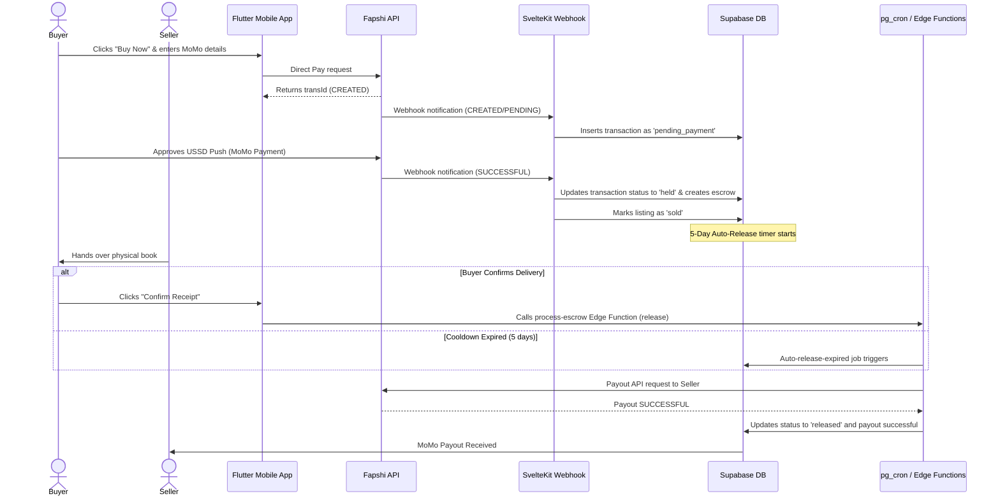

# BookBridge 📚

[](https://flutter.dev/)
[](https://supabase.com/)
[](https://kit.svelte.dev/)
[](https://opensource.org/licenses/MIT)
[](https://flutter.dev/)
[](https://github.com/DCT-Berinyuy/book-bridge)

> **A Social Venture to End Learning Poverty in Cameroon**

BookBridge is a peer-to-peer marketplace designed for Cameroonian students to buy and sell used physical books. Powered by Flutter and Supabase, it facilitates affordable access to textbooks and educational resources while enabling students to recycle and monetize their book collections.

**Our Mission**: To democratize access to education in Cameroon, addressing the crisis where **72% of children** cannot read and understand simple text by age 10.

---

## 📸 Screenshots

<div align="center">
  
  
  
</div>

---

## 🌟 Key Features

### Core Marketplace
* **User Authentication**: Secure sign-in and profile synchronization via Supabase Auth.
* **Smart Search**: Full-text indexing across book titles and authors using PostgreSQL `tsvector` with relevance ranking.
* **Direct Handover Flow**: Intuitive purchase flow featuring user-to-user coordination.
* **Category Filtering**: Browse books by category (textbooks, novels, references, etc.) with responsive chips.
* **Secure Storage**: Public book cover images hosted securely via bucket policies in Supabase Storage.

### Automated Escrow System (MoMo Integration)
* **Secure Holds**: Funds are collected via **Fapshi Direct Pay (MoMo/Orange Money)** and held in escrow until the buyer confirms physical handover.
* **5-Day Auto-Release**: Prevents sellers from being ghosted. Escrows are automatically released to the seller after 5 days if no dispute is filed.
* **Status Polling**: A pg_cron background worker Edge Function checks payment status every 5 minutes to automatically resolve transactions stuck in `pending_payment`.
* **Dispute Freeze**: Buyers can report problems to freeze the auto-release timer and trigger admin review.
* **Secure Payouts**: Payout execution is handled entirely server-side (Edge Functions) using database secrets via `app_secrets` (RLS enforced).
* **Audit Logging**: Every API transaction with Fapshi is logged in `fapshi_audit_logs` for transaction history, tracing, and fraud prevention.

---

## 🏗️ Architecture

BookBridge follows **Clean Architecture** patterns separating business logic, UI, and data layers:

```
lib/
├── core/                      # Shared assets, utilities, and components
│   ├── error/                # Functional error handling (Failures, Exceptions)
│   ├── theme/                # Custom Material Design 3 theme
│   └── usecases/             # Base abstract UseCase contracts
├── features/                 # Modules encapsulating distinct functionality
│   ├── auth/                 # Domain, data, and presentation layers for Auth
│   ├── chat/                 # Real-time message exchange
│   ├── favorites/            # Wishlists and saved listings
│   ├── listings/             # Browsing, listing creation, and category search
│   ├── payments/             # Fapshi Direct Pay integration & ViewModels
│   ├── reviews/              # Buyer/Seller trust rating system
│   └── transactions/         # Escrow confirm and dispute handlers
├── config/                   # Global configuration
│   ├── app_config.dart      # Dart define environment bindings
│   └── router.dart          # Route configurations (go_router)
├── injection_container.dart  # GetIt dependency injection setup
└── main.dart                # Application entry point
```

### Escrow Architecture Sequence


```mermaid
sequenceDiagram
    actor Buyer
    actor Seller
    participant App as Flutter Mobile App
    participant Fapshi as Fapshi API
    participant Webhook as SvelteKit Webhook
    participant DB as Supabase DB
    participant Cron as pg_cron / Edge Functions

    Buyer->>App: Clicks "Buy Now" & enters MoMo details
    App->>Fapshi: Direct Pay request
    Fapshi-->>App: Returns transId (CREATED)
    Fapshi->>Webhook: Webhook notification (CREATED/PENDING)
    Webhook->>DB: Inserts transaction as 'pending_payment'
    Buyer->>Fapshi: Approves USSD Push (MoMo Payment)
    Fapshi->>Webhook: Webhook notification (SUCCESSFUL)
    Webhook->>DB: Updates transaction status to 'held' & creates escrow
    Webhook->>DB: Marks listing as 'sold'
    Note over DB: 5-Day Auto-Release timer starts
    Seller->>Buyer: Hands over physical book
    alt Buyer Confirms Delivery
        Buyer->>App: Clicks "Confirm Receipt"
        App->>Cron: Calls process-escrow Edge Function (release)
    else Cooldown Expired (5 days)
        Cron->>DB: Auto-release-expired job triggers
    end
    Cron->>Fapshi: Payout API request to Seller
    Fapshi-->>Cron: Payout SUCCESSFUL
    Cron->>DB: Updates status to 'released' and payout successful
    DB->>Seller: MoMo Payout Received
```

---

## 🚀 Getting Started

### Prerequisites
* Flutter SDK (v3.10.7 or higher)
* Supabase CLI / Account
* Node.js (for SvelteKit Landing Page)

### Repository Setup
1. Clone the project:
   ```bash
   git clone https://github.com/DCT-Berinyuy/book-bridge.git
   cd book-bridge
   ```
2. Fetch packages:
   ```bash
   flutter pub get
   ```

### Configuration
Create a `.env` file in the project root:
```env
SUPABASE_URL=https://your-project.supabase.co
SUPABASE_ANON_KEY=your-anon-key
FAPSHI_API_USER=your-fapshi-user
FAPSHI_API_KEY=your-fapshi-key
FAPSHI_BASE_URL=https://live.fapshi.com
```

### Launching the App
Run the application with environments injected using `--dart-define`:
```bash
flutter run \
  --dart-define="SUPABASE_URL=$(grep SUPABASE_URL .env | cut -d'=' -f2)" \
  --dart-define="SUPABASE_ANON_KEY=$(grep SUPABASE_ANON_KEY .env | cut -d'=' -f2)" \
  --dart-define="FAPSHI_API_USER=$(grep FAPSHI_API_USER .env | cut -d'=' -f2)" \
  --dart-define="FAPSHI_API_KEY=$(grep FAPSHI_API_KEY .env | cut -d'=' -f2)"
```

### Running Landing Page (SvelteKit)
```bash
cd landingPage
npm install
npm run dev
```

---

## 📊 Database Schema Highlights

### `transactions` Table
Stores buyer purchase logs and commissions.
```sql
CREATE TABLE public.transactions (
    id UUID DEFAULT gen_random_uuid() PRIMARY KEY,
    listing_id UUID NOT NULL REFERENCES public.listings(id) ON DELETE CASCADE,
    buyer_id UUID NOT NULL REFERENCES auth.users(id) ON DELETE CASCADE,
    seller_id UUID NOT NULL REFERENCES auth.users(id) ON DELETE CASCADE,
    amount INTEGER NOT NULL CHECK (amount > 0),
    payment_reference TEXT UNIQUE NOT NULL,
    status TEXT NOT NULL DEFAULT 'pending' CHECK (status IN ('pending', 'pending_payment', 'successful', 'failed', 'held', 'disputed')),
    payout_status TEXT DEFAULT 'pending',
    payout_reference TEXT,
    commission_amount INTEGER,
    created_at TIMESTAMPTZ DEFAULT NOW()
);
```

### `escrow_transactions` Table
Manages the auto-release deadline timer.
```sql
CREATE TABLE public.escrow_transactions (
  id               UUID DEFAULT gen_random_uuid() PRIMARY KEY,
  transaction_id   UUID NOT NULL REFERENCES public.transactions(id) ON DELETE CASCADE,
  status           TEXT NOT NULL DEFAULT 'held' CHECK (status IN ('held', 'released', 'refunded', 'disputed')),
  dispute_reason   TEXT,
  created_at       TIMESTAMP WITH TIME ZONE DEFAULT NOW(),
  updated_at       TIMESTAMP WITH TIME ZONE DEFAULT NOW(),
  release_deadline TIMESTAMP WITH TIME ZONE GENERATED ALWAYS AS (public.add_5_days(created_at)) STORED
);
```

### `fapshi_audit_logs` Table
Maintains payout auditing logs for administrative review.
```sql
CREATE TABLE public.fapshi_audit_logs (
  id               UUID DEFAULT gen_random_uuid() PRIMARY KEY,
  transaction_id   UUID REFERENCES public.transactions(id) ON DELETE SET NULL,
  endpoint         TEXT NOT NULL,
  request_payload  JSONB,
  response_payload JSONB,
  status_code      INTEGER,
  created_at       TIMESTAMP WITH TIME ZONE DEFAULT NOW()
);
```

---

## 🧭 Navigation & Routes

The application leverages `go_router` supporting authentication redirects and shell layouts:

| Route | Screen | Auth? | Description |
| :--- | :--- | :--- | :--- |
| `/` | SplashScreen | No | Sessions startup and auth routing |
| `/sign-in` | SignInScreen | No | User login portal |
| `/home` | HomeScreen | Yes | Browse books listings feed |
| `/search` | SearchScreen | Yes | Run FTS indexing search queries |
| `/sell` | SellScreen | Yes | Book details registration and storage uploads |
| `/profile` | ProfileScreen | Yes | User details, feedback, and active listings |
| `/listing/:id`| ListingDetailsScreen | Yes | Specific book details & checkout portal |

---

## 🤝 Contributing Guidelines

1. Fork the Repository.
2. Create a Feature Branch (`git checkout -b feature/AmazingFeature`).
3. Follow the Clean Architecture design rules.
4. Ensure files are properly formatted:
   ```bash
   dart format .
   flutter analyze
   ```
5. Commit your Changes (`git commit -m 'feat: Add AmazingFeature'`).
6. Push to Branch (`git push origin feature/AmazingFeature`).
7. Open a Pull Request.

---

## 📄 License

This project is licensed under the MIT License - see the [LICENSE](LICENSE) file for details.

---

<div align="center">
  <b>Made with ❤️ for Cameroonian students</b><br>
  <i>Democratizing access to knowledge, one book at a time.</i>
</div>
